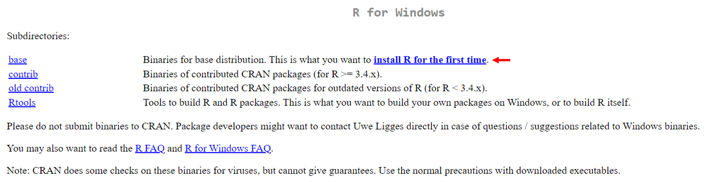
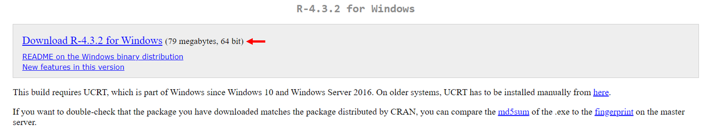
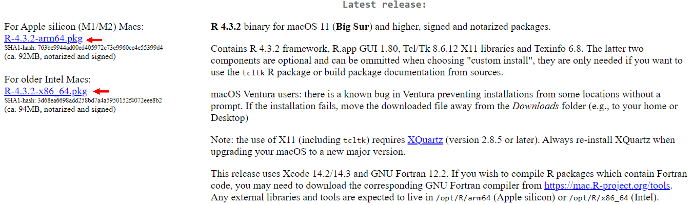
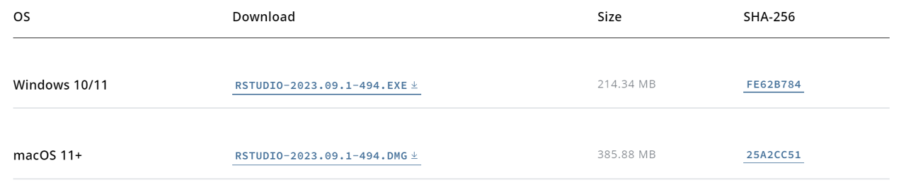
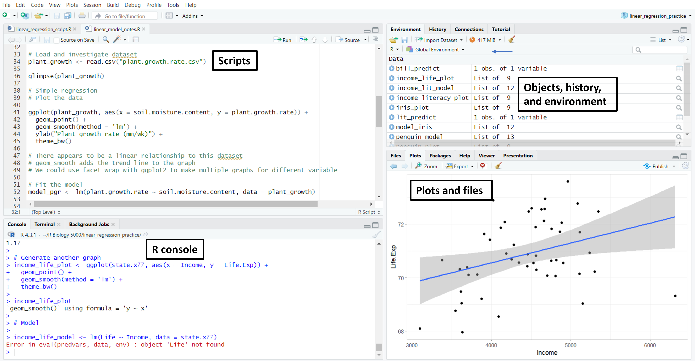
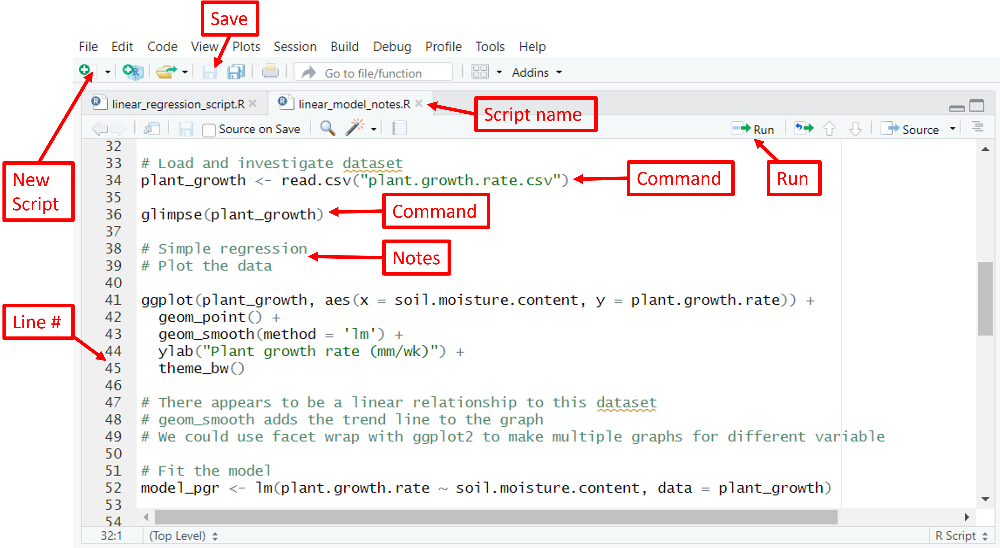
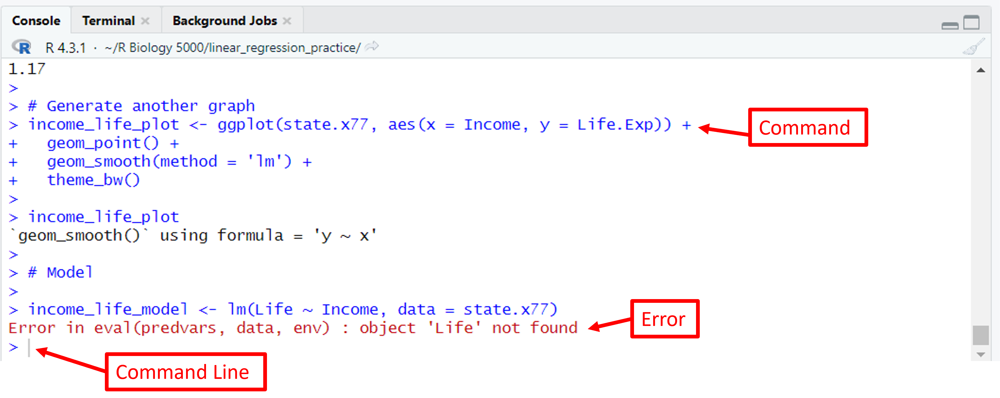
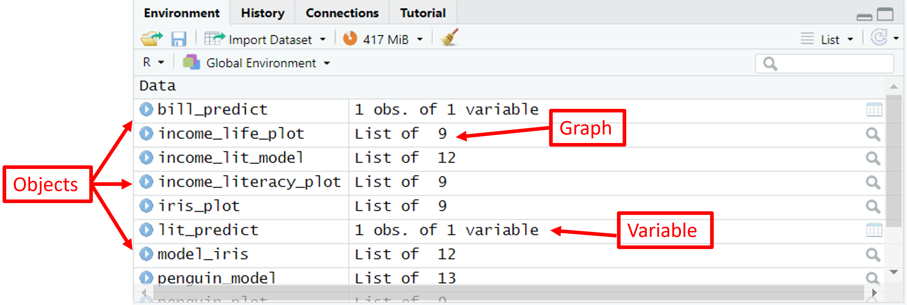
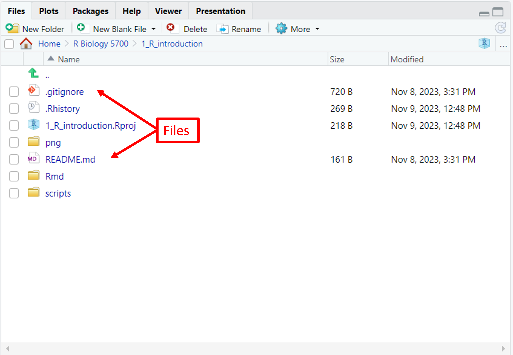
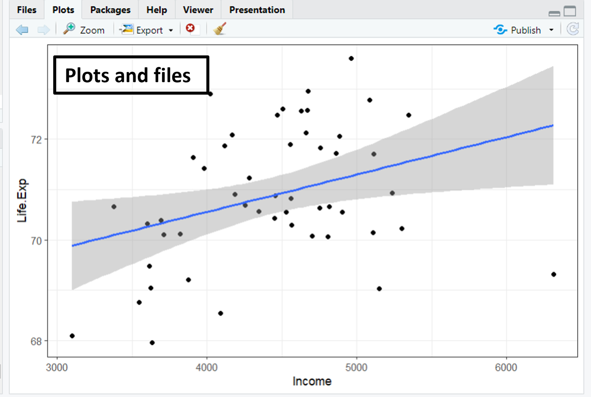

```{r setup, include=FALSE}

library(tidyverse)
library(knitr)      
library(leaflet)
library(dplyr)
library(hexbin)
library(ggplot2)

```

# What is R?

<li>R is a programming language and environment designed for performing statistical analyses and visualizing data.</li>
<li>R is open source, meaning that users can legally modify and redistribute software.</li>
<li>R is script-based, meaning that text is used to write programs and automate tasks.</li><br>

# What is RStudio?
<li>RStudio is an integrated development environment which provides a user-friendly interface to work with R.</li>
<li>RStudio streamlines writing scripts and editing code and simplifies managing data and files.</li>
<li>While RStudio is designed primarily for R, it is also compatible with other programming languages such as Python and HTML.</li><br>

# Installing R and RStudio

## Install R

<li>R can be downloaded by first clicking the link [here](http://cran.r-project.org/
), followed by choosing the correct operating system.</li><br>

```{r cran site, message=FALSE, warning=FALSE, echo=FALSE, fig.show = "hold", out.width = "100%", fig.align = "center"}
knitr::include_graphics("../png/r_download.png")
```
<br>**Download for [Windows](https://cran.r-project.org/bin/windows/)**

<li>On the R for Windows page select install R for the first time.</li><br>
```{r win install, message=FALSE, warning=FALSE, echo=FALSE, fig.show = "hold", out.width = "100%", fig.align = "center"}

```
<br><li>Next, select Download R-4.3.2 for Windows.</li><br>
```{r win download, message=FALSE, warning=FALSE, echo=FALSE, fig.show = "hold", out.width = "100%", fig.align = "center"}

```
<br><li>The .exe file should appear in your downloads to complete installation.</li><br>

<br>**Download for [Mac](https://cran.r-project.org/bin/macosx/)**

<li>On the R for mac page select the correct version of your operating system.<br><br>
```{r mac download, message=FALSE, warning=FALSE, echo=FALSE, fig.show = "hold", out.width = "100%", fig.align = "center"}

```
<br><li>The .pkg file should appear in your downloads to complete installation.</li><br>

## Install RStudio

<li>Follow the link [here](https://posit.co/download/rstudio-desktop/) to download RStudio.</li>
<li>Scroll down and select the correct operating system to download.</li><br>

```{r rstudio download, message=FALSE, warning=FALSE, echo=FALSE, fig.show = "hold", out.width = "100%", fig.align = "center"}

```
<br><li>The file should appear in your downloads to complete installation.</li><br>

# Getting Familiar with RStudio


## RStudio Interface

<li>For working with R we will use RStudio.</li>
<li>Make sure to launch RStudio instead of R to begin.</li>
<li>The RStudio interface can be seen below.</li><br>

```{r interface, message=FALSE, warning=FALSE, echo=FALSE, fig.show = "hold", out.width = "100%", fig.align = "center"}

```

## Scripts

<li>A script is simply a text file which contains a sequence of commands for R to perform.</li>
<li>Scripts must be run for R to perform desired tasks.</li>
<li>When ran, commands from the script are transferred to the command line in the console where commands will be performed.</li>
<li>Any text preceded by a # will not be transferred to the command line.</li>
<li>Code in a script is read in sequence, order is important!</li>
<li>Scripts in RStudio are in a .R file format.</li><br>

```{r scripts, echo=FALSE, message=FALSE, warning=FALSE, fig.show = "hold", out.width = "100%", fig.align = "center"}


```

## Console

<li>The console is where commands in R are executed and results are shown.</li>
<li>Commands can be typed directly into the console in the command line, but are more frequently ran as scripts.</li>
<li>Some results such as objects and plots are not shown in the console</li>
<li>If a script is not written correctly, the error will show up in the console below the command that could not be executed.</li><br>

```{r console, echo=FALSE, message=FALSE, warning=FALSE, fig.show = "hold", out.width = "100%", fig.align = "center"}

```

## Environment

<li>Objects (functions, variables, tables, graphs) which are created are shown in the environment.</li>
<li>For our purposes we will generally not save the environment from one session to another.</li>
<li>The broom symbol at the top of the pane clears the environment</li>
<li>Objects are created with this notation in a script object_name <- command()</li><br>

```{r environment, echo=FALSE, message=FALSE, warning=FALSE, fig.show = "hold", out.width = "100%", fig.align = "center"}

```

## Files and Plots

<li>The bottom right pane is where you can view plots and files</li>
<li>Looking at the file pathway in the bottom right can be useful in setting up working directories or understanding file pathways in your computer.</li>
<li>Graphs which are plotted that are not saved as objects will show up in plots.</li><br>

```{r files and plots, echo=FALSE, message=FALSE, warning=FALSE, fig.show = "hold", out.width = "50%", fig.align = "default"}


```

# Packages

<li>Packages are collections of functions created by other R users to add functionality to R.</li>
<li>Packages are stored in libraries.</li>
<li>Packages must be installed before use.</li>
<li>Each script must load the required packages to complete that script using library() and other commands.</li>
<li>We'll cover more about packages once we begin using R.</li><br>


# Summary

<li>**R** is an open source programming language using text-based commands to complete tasks.</li>
<li>**RStudio** is an interface which streamlines the use of the R programming language.</li>
<li>The RStudio **interface** includes four panes.</li>
<li>The **script** pane in the top left is where .R text files containing sequences of commands are written.</li>
<li>The **console** pane in the bottom left is where R commands are executed.</li>
<li>The **environment** in the top right shows objects which have been created by R commands.</li>
<li>The bottom right pane shows **files** in the working directory and **plots**.</li>
<li>**Packages** are installed and loaded in scripts to add functionality to the R programming language.</li><br>


# Additional Resources

<iframe width="560" height="315" src="https://www.youtube.com/embed/YrEe2TLr3MI?si=R0EeDtBUd9DO1yRD" data-external="1"></iframe>

<iframe width="560" height="315" src="https://www.youtube.com/embed/FIrsOBy5k58?si=2hOU2_vtAh3B9Vu5" data-external="1"></iframe>
