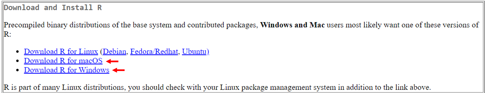

```{r setup, include=FALSE}

library(tidyverse)
library(knitr)      
library(leaflet)
library(dplyr)
library(hexbin)
library(ggplot2)

```

# What is R?

<li>R is a programming language and environment designed for performing statistical analyses and visualizing data.</li>
<li>R is open source, meaning that users can legally modify and redistribute software.</li>
<li>R is script-based, meaning that text is used to write programs and automate tasks.</li>

# What is RStudio?
<li>RStudio is an integrated development environment which provides a user-friendly interface to work with R.</li>
<li>RStudio streamlines writing scripts and editing code and simplifies managing data and files.</li>
<li>While RStudio is designed primarily for R, it is also compatible with other programming languages such as Python and HTML.</li>

# Installing R and RStudio

## Install R

<li>R can be downloaded by first clicking the link [here](http://cran.r-project.org/
), followed by choosing the correct operating system.</li>

```{r cran site, message=FALSE, warning=FALSE, echo=FALSE, fig.show = "hold", out.width = "100%", fig.align = "center"}

```
<br>**Download for [Windows](https://cran.r-project.org/bin/windows/)**

<li>On the R for Windows page select install R for the first time.</li>
```{r win install, message=FALSE, warning=FALSE, echo=FALSE, fig.show = "hold", out.width = "100%", fig.align = "center"}
knitr::include_graphics("../png/install_windows.png")
```
<br><li>Next, select Download R-4.3.2 for Windows.</li>
```{r win download, message=FALSE, warning=FALSE, echo=FALSE, fig.show = "hold", out.width = "100%", fig.align = "center"}

```
<br><li>The .exe file should appear in your downloads to complete installation.</li> 

<br>**Download for [Mac](https://cran.r-project.org/bin/macosx/)**

<li>On the R for mac page select the correct version of your operating system. 
```{r mac download, message=FALSE, warning=FALSE, echo=FALSE, fig.show = "hold", out.width = "100%", fig.align = "center"}

```
<br><li>The .pkg file should appear in your downloads to complete installation.</li>

## Install RStudio

<li>Follow the link [here](https://posit.co/download/rstudio-desktop/) to download RStudio.</li>
<li>Scroll down and select the correct operating system to download.</li>

```{r rstudio download, message=FALSE, warning=FALSE, echo=FALSE, fig.show = "hold", out.width = "100%", fig.align = "center"}
knitr::include_graphics("../png/rstudio_download.png")
```
<br><li>The file should appear in your downloads to complete installation.</li>

# Getting Familiar with RStudio

## RStudio Interface

```{r interface, message=FALSE, warning=FALSE, echo=FALSE, fig.show = "hold", out.width = "100%", fig.align = "center"}

```

